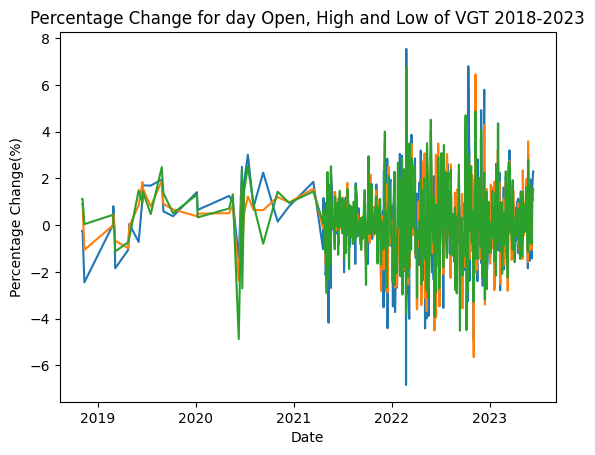
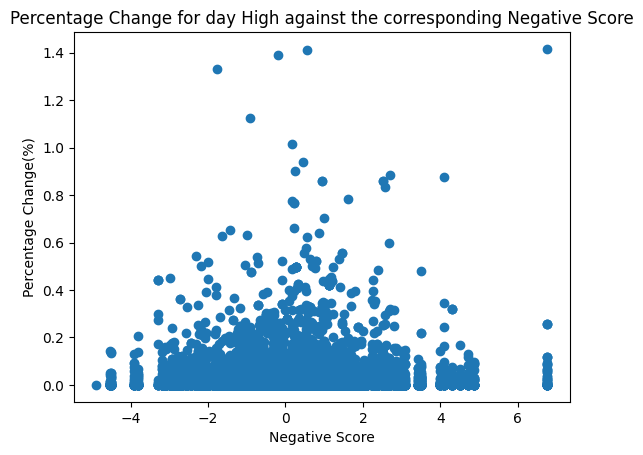
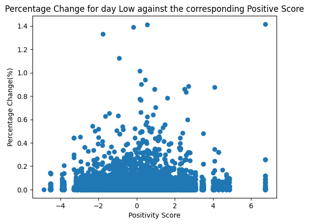
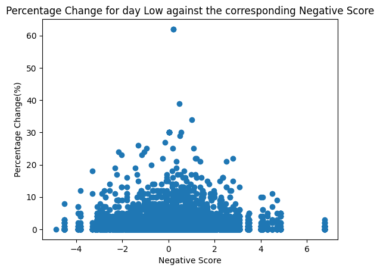

# README: Media Sentiment and Stock Market Analysis

## Introduction

The purpose of this project is to explore the relationship between media sentiment and stock market price action, specifically in the context of large-cap tech stocks. These securities are known for their volatility and their tendency to fluctuate according to public sentiment, making them interesting to study. Through writing custom sentiment analysis techniques using statistics such as frequency distribution, I aim to get a good picture of what kind of influence the article is expected to have on the stock price. 

This research question gives me an opportunity to expand upon and use techniques learned in this module such as tokenization, frequency distributions, computational linguistics, and VADER. In this study, I specifically focus on the impact of media sentiment on the stock price of VGT (Vanguard Technology Index Fund) and by extension its constituents. The classifier analyzes news from all the tickers making up the fund.

The results of this investigation are to benefit financial analysts, investors, and market strategists in making more informed decisions. News analysis is likely one of many tools in the arsenal that can help them make money in the markets; however, it is still a very important one. If the news can help us predict future stock prices even slightly, it is an edge worth exploring.

## Literature Review

Studies have made great progress in advancing our understanding by showing that there is a positive correlation between sentiment scores and market returns. In 2008, Sankaraguruswamy found that media-created sentiment through things such as earnings reports has an impact on stock price, especially in stocks that are volatile. Additional research also shows the role of sentiment and how it manifests in investor behavior. However, it seems to be scarce in terms of different timeframes.

Most studies tend to focus more on a general market sentiment that drives stock prices rather than the titles and content of specific news articles. This research hopes to fill in some of this gap and provide a more niche, specialized analysis with regard to real news articles.

Despite research and development of newer and more sophisticated sentiment indices, the reliance and variability of how much sentiment affects stock returns in different market states has not been examined in detail. This project captures this by analyzing correlations for different timeframes to infer during which timeframes the market is most susceptible to media sentiment.

The rise in popularity of social networks has allowed new ways of sentiment analysis, but scientific literature exploring this does not usually provide a comparison of the effectiveness of different media sources. Traditional media has been shown to lead to fluctuations in investor sentiment and therefore impact their trading decisions.

## Technical Solution

For this investigation, I have used data from [polygon.io](https://polygon.io). This is because they are the best I could find that offers news articles for specific tickers. I then use `yfinance` for the tickers because the API access is too slow on polygon.io (5 requests per minute), and the volume of data we have is too large.

I have created my own scores using frequency distributions and VADER together. VADER figures were only taken into account when non-zero. Typically with VADER, "the compound score is computed by summing the valence scores of each word in the lexicon, adjusted according to the rules, and then normalized to be between -1 (most extreme negative) and +1 (most extreme positive)."

This way, if a text is very positive for both indicators, it will be much more positive compared to the latter. Additionally, there is specific finance terminology which indicates positive sentiment towards the stock price that is not typically included in the tweets that VADER was trained on (e.g., "bullish", "bearish").

## Results

### Overview of Data

Fig. 1 shows an overview of the news data we have against VGT pricing history data. Key observations:
- The number of news articles increases closer to the present.
- It is rare to have more than a ±4% change in stock prices, aligning with the index fund's purpose to protect against market volatility.

### Correlation Matrix

Table 1 provides a correlation matrix between calculated sentiment scores and the percentage changes of the high and low stock price the next day for the VGT ticker. Pearson's method was used for calculating the correlation coefficient.

|                 | % Change High | % Change of Low |
|-----------------|---------------|-----------------|
| Positivity Score | 0.005561      | 0.032749        |
| Negativity Score | 0.032749      | 0.013032        |

### Scatter Plots

- **Fig. 1**: Percentage Change for day Open High and Low.  
  

Scatter plots provide a better visualization of the correlation between sentiment scores and stock price changes:
- **Fig. 2**: Percentage Change for day High against the corresponding Positivity Score.  
  
  
- **Fig. 3**: Percentage Change for day High against the corresponding Negativity Score.  
  
  
- **Fig. 4**: Percentage Change for day Low against the corresponding Positive Score.  
  
  
- **Fig. 5**: Percentage Change for day Low against the corresponding Negativity Score.  
  

No significant correlation was observed across the data.

## Conclusions

The news articles show an extremely weak to no correlation with the ensuing percentage changes in both stock highs and lows. The news articles do not provide a good foundation to predict changes in stock prices as we can see from the table and graphs not showing any concrete correlation.

### Potential Improvements
1. **Timeframe Analysis**: Analyzing data over different timeframes may yield different results as news media takes time to influence investor behavior.
2. **Focus on Individual Stocks**: Narrowing the study to a single company ticker rather than an index fund might result in more pronounced correlations.

